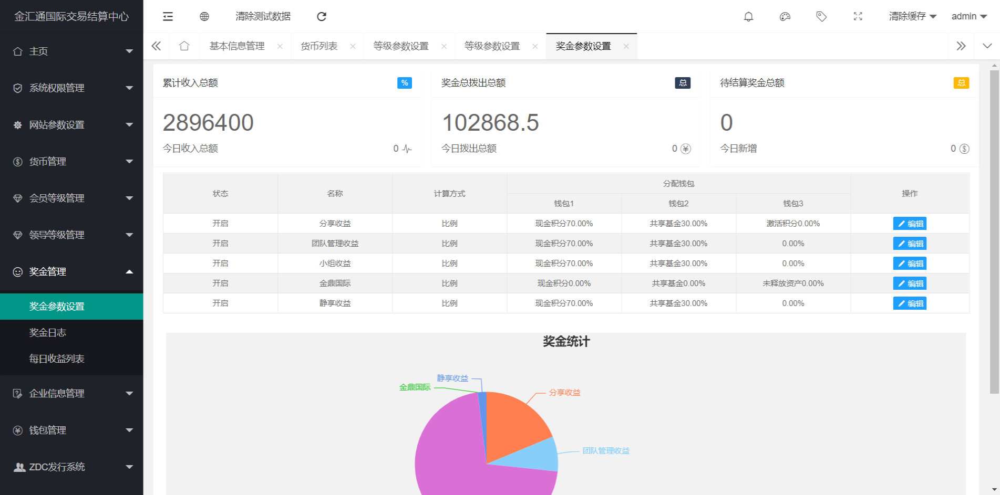

# FToken全新钱包区块链,奖励参数强大，可随意配置 源码

pc演示地址：https://ftoken.waps.eu.org

app演示地址：https://ftoken.waps.eu.org/app/download/

测试账号：99999

测试密码：aa123321

功能列表：

1：区块链钱包产出，投资的好去处。

2：可以自定义级别。

3：多种奖励随意设置。

4：充值采用usdt 20地址。

5：提现同样采用usdt 20。

6：各种积分互转。

7：多语言支持。

8：收益日志非常详细。

9：后台功能异常强大，自由配置各类参数。

 Ver 2.03 版本

1: 此钱包基于TP5.1的内核。

2: 内核已经升级到new，安全无忧。

3: 优化手机版界面以及众多bug。

4: 增强主流浏览器兼容性。

5: 安卓和苹果双端。

6: 无忧版。

## Screenshots

# 声明

1. 使用本系统方必须在国家相关法律法规范围内并经过国家相关部门的授权许可，禁止用于一切非法行为。

2. 本系统限于测试、实验、研究为目的，禁止用于一切商业运营，本团队不承担使用者在使用过程中的任何违法行为负责。

3. 源码以演示站为准。

